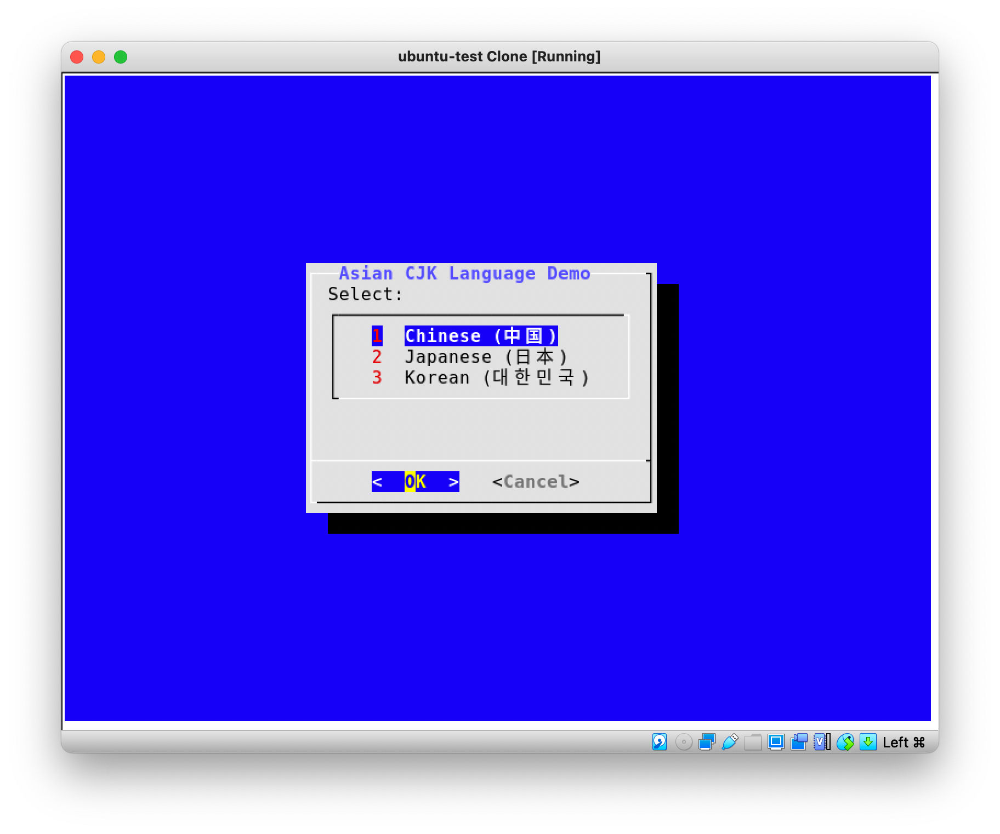

# Linux Server Console CJK Fonts (POC)

## Description

Given a stock Ubuntu 20.04 server, configure it to:

* Upon boot, autostart X that starts xterm that starts a Dialog menu as a non-root user prompting the user to choose Asian languages shown in unicode:
  * Chinese (中国)
  * Japanese (日本)
  * Korean (대한민국)

Running setup.sh will:
* Install X and Xterm
* Install Google CJK (Chinese, Japanes, Korean) Fonts
* Create dialog script that uses CJK fonts
* Create a linux user called 'user'
* Configure X with an .Xresources and .xinitrc to kick off xterm and the dialog script as the 'user'
* Override getty system service to start X instead.





## Installation

* Create an Ubuntu server 20.04LTS machine
* Login as any user
* Execute the setup script

```
curl https://raw.githubusercontent.com/dcwangmit01/linux-cjk-console/master/setup.sh | bash
```

* Now, verify that the console is displaying dialog with CJK fonts.
